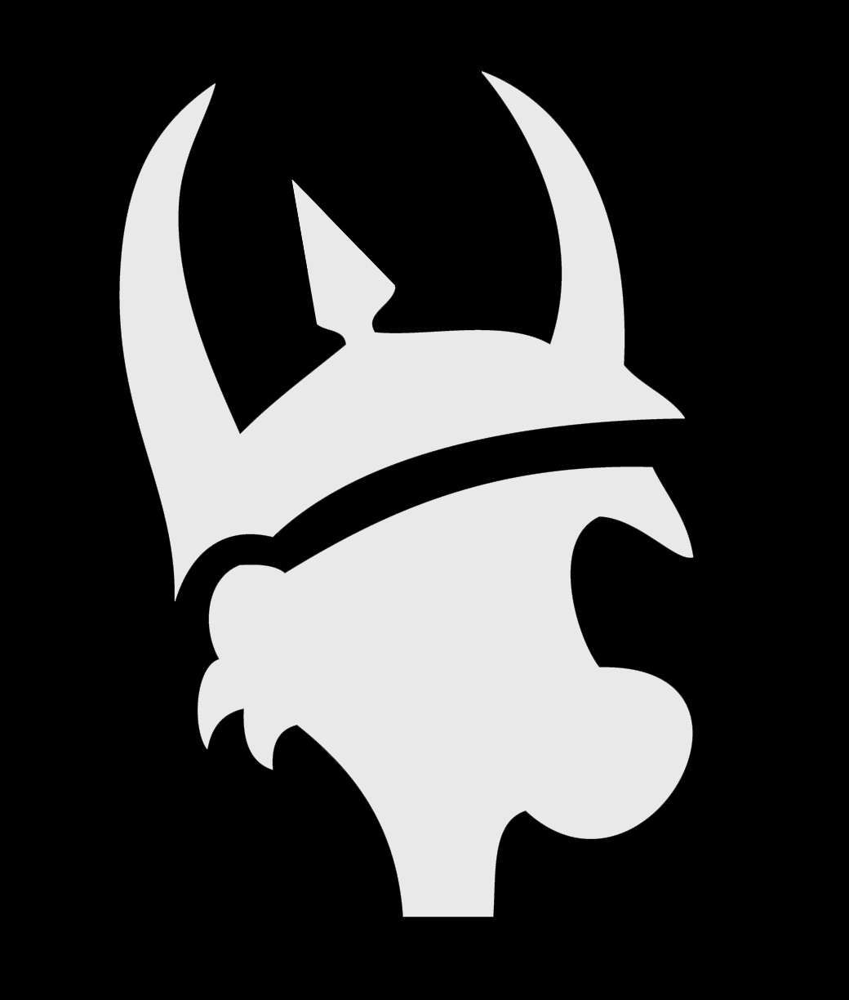

# Munchkin Companion PWA

Aplicación web progresiva en tiempo real para registrar niveles, equipamiento y fuerza de combate durante partidas de **Munchkin** — sin necesidad de instalación.



## Funcionalidades

- **Sincronización en tiempo real** — Todos los jugadores ven los cambios al instante (<100ms)
- **Sin registro obligatorio** — Únete con un código de 4 caracteres; con cuenta se guardan tu nivel, tu experiencia y tu historial
- **Mobile-first** — Optimizado para móviles con controles táctiles amplios
- **Seguimiento de combate** — Resolución completa con modificadores de monstruo/jugador y sistema de ayudante
- **Gestión de turnos** — Orden de turno forzado con roles activo/pasivo
- **Equipamiento** — Ranuras de cabeza, armadura, manos y pies con mochila de almacenamiento
- **Panel del anfitrión** — Expulsar jugadores, reordenar turnos y gestionar la partida
- **Historial de partidas** — Consulta sesiones y resultados anteriores
- **Perfil propio** — Con cuenta: nombre de munchkin, género, nivel y experiencia

## Tecnologías

| Capa | Tecnología |
|------|-----------|
| Frontend | React 19 + TypeScript |
| Build | Vite |
| Estilos | Tailwind CSS v4 |
| Estado | React Context API |
| Backend | API PHP + MySQL (`public/api/`) |
| Auth | Keycloak **opcional** — se puede jugar sin cuenta |
| Enrutamiento | React Router DOM v7 |
| Iconos | Lucide React |

## Requisitos previos

- [Node.js](https://nodejs.org/) 18+
- Un hosting con **PHP** y **MySQL** (el webspace de IONOS) donde desplegar
- Los ficheros de acceso de `webspace-gate` (`login.php`, `registro.php`, `logout.php`,
  `session.php`, `db.php`) en el docroot. **No hacen de puerta**: el sitio es público y la sesión
  solo añade progreso
- Los esquemas `sql/01_core.sql`, `sql/02_munckin.sql` y `sql/04_munckin_invitados_xp.sql`
  ejecutados en la base

## Puesta en marcha

### 1. Clonar el repositorio

```bash
git clone https://github.com/CodeMaho/TableManager.git
cd TableManager
```

### 2. Instalar dependencias

```bash
npm install
```

### 3. Configurar el backend

No hay credenciales que poner en el frontend: la identidad la aporta la cookie de sesión que
firma la puerta, y la API vive en el mismo origen. La configuración (base de datos y secreto de
la app) está en el `config.php` de la puerta, en el servidor.

### 4. Iniciar el servidor de desarrollo

```bash
npm run dev
```

La app estará en `http://localhost:5173`, pero **las llamadas a `/api/*.php` fallarán**: no hay
PHP ni sesión de la puerta en local. Para probar el flujo completo hay que desplegar en el
subdominio, o levantar un proxy hacia él en `vite.config.ts`.

## Scripts disponibles

| Comando | Descripción |
|---------|-------------|
| `npm run dev` | Inicia el servidor de desarrollo con HMR |
| `npm run build` | Comprueba tipos y genera la build de producción |
| `npm run preview` | Previsualiza la build de producción en local |
| `npm run lint` | Ejecuta ESLint |

## Despliegue

La app ya **no es estática**: necesita PHP y MySQL, así que se despliega en el webspace.

```bash
npm run build
```

Y se sube el contenido de `dist/` al docroot del subdominio, junto a `login.php`, `logout.php`,
`registro.php`, `session.php`, `db.php`, `api/perfil.php` y `config.php`.
El `.htaccess` sale ya en el build: sirve los ficheros en abierto, deja las rutas de la SPA a
React y bloquea por URL los `.php` que solo deben incluirse.

## Estructura del proyecto

```
src/
├── components/
│   ├── PerfilJugador.tsx       # Nivel, experiencia y cerrar sesión (inicio)
│   ├── EditarPerfil.tsx        # Nombre de munchkin y género
│   ├── layout/
│   │   ├── GameLayout.tsx      # Contenedor principal del juego
│   │   └── Navbar.tsx          # Indicador de turno y estado
│   ├── game/
│   │   ├── StatTracker.tsx     # Componente stepper [-] Valor [+]
│   │   ├── GearSlot.tsx        # Ranura de equipamiento con icono
│   │   ├── PlayerCard.tsx      # Tarjeta resumen de un rival
│   │   ├── PlayerAvatar.tsx    # Componente de avatar
│   │   └── CombatOverlay.tsx   # Modal de modo combate
│   └── lobby/
│       └── LobbyList.tsx       # Lista de jugadores en sala de espera
├── context/
│   └── GameContext.tsx         # Proveedor global de estado
├── hooks/
│   ├── useAuth.ts              # Identidad desde /api/jugador.php (opcional)
│   ├── useGame.ts              # Sondeo de /api/estado.php + escrituras
│   └── useCombat.ts            # Cálculo de fuerza de combate
├── pages/
│   ├── HomePage.tsx            # Pantalla de crear/unirse a partida
│   ├── LobbyPage.tsx           # Sala de espera previa al juego
│   └── GamePage.tsx            # Vista principal de la partida
├── services/
│   └── api.ts                  # Cliente HTTP de /api/*.php
├── types/
│   └── game.ts                 # Interfaces TypeScript
└── utils/
    ├── avatarUrl.ts            # Utilidades de avatar
    └── munchkinMath.ts         # Fórmulas de fuerza de combate
```

## Modelo de datos

Las partidas se guardan en MySQL (esquema en `keycloak-api/webspace-gate/sql/02_munckin.sql`):

```
munckin_perfil            # perfil por usuario: nombre, preferencias, XP y
                          # contadores de partidas/victorias
munckin_partida           # meta + turnState + combatState en una fila,
                          # con `rev` (contador de cambios para el sondeo)
munckin_partida_jugador   # una fila por jugador: name, isReady, attributes, gear
```

`/api/estado.php` devuelve ese estado con **la misma forma** que tenía en Firebase, para que los
componentes no cambien:

```
{ meta, turnState, combatState, players: { <ID_JUGADOR>: PlayerProfile } }
```

El id de jugador es `usuario.id`. Con cuenta deriva del `sub` de Keycloak y es el mismo en
cualquier dispositivo; sin cuenta es un invitado atado a una cookie del navegador.

### Progresión (solo con cuenta)

Al cerrar una partida se fija la clasificación —nivel alcanzado, y a igualdad fuerza de combate—
y se reparte experiencia: **100 / 60 / 40 / 30 / 25**, y **20** del quinto puesto en adelante.
**100 XP = 1 nivel.** El nivel no se guarda en ningún sitio: se deriva de la XP, así no puede
descuadrarse.

### Perfil de jugador

```typescript
interface PlayerProfile {
  name: string;
  isReady: boolean;
  attributes: {
    level: number;   // 1 – nivelMáximo
    debuff: number;
    sex: 'M' | 'F';
    race: string;
    class: string;
  };
  gear: {
    head: number;
    armor: number;
    hands: number;
    feet: number;
    backpack: string[];
  };
}
```

**Fuerza de combate** (calculada en el frontend):
```
fuerzaCombate = nivel + cabeza + armadura + manos + pies - debuff
```

## Resumen de reglas

- Cada jugador empieza en **Nivel 1** y busca alcanzar el nivel máximo configurado (por defecto: 10).
- En tu turno puedes luchar contra monstruos, mejorar equipamiento y vender objetos por niveles.
- **Combate:** `LadoMunchkin = (Jugador + Ayudante fuerza de combate) + ModificadoresJugador` vs `NivelMonstruo + ModificadoresMonstruo`.
- Vender objetos: cada **1000 Oro = +1 Nivel** (no se puede ganar solo vendiendo).
- Otro jugador puede unirse al combate como **Ayudante** mediante una solicitud de aceptación.
- El primer jugador en alcanzar el nivel máximo gana la partida.

## Licencia

MIT
